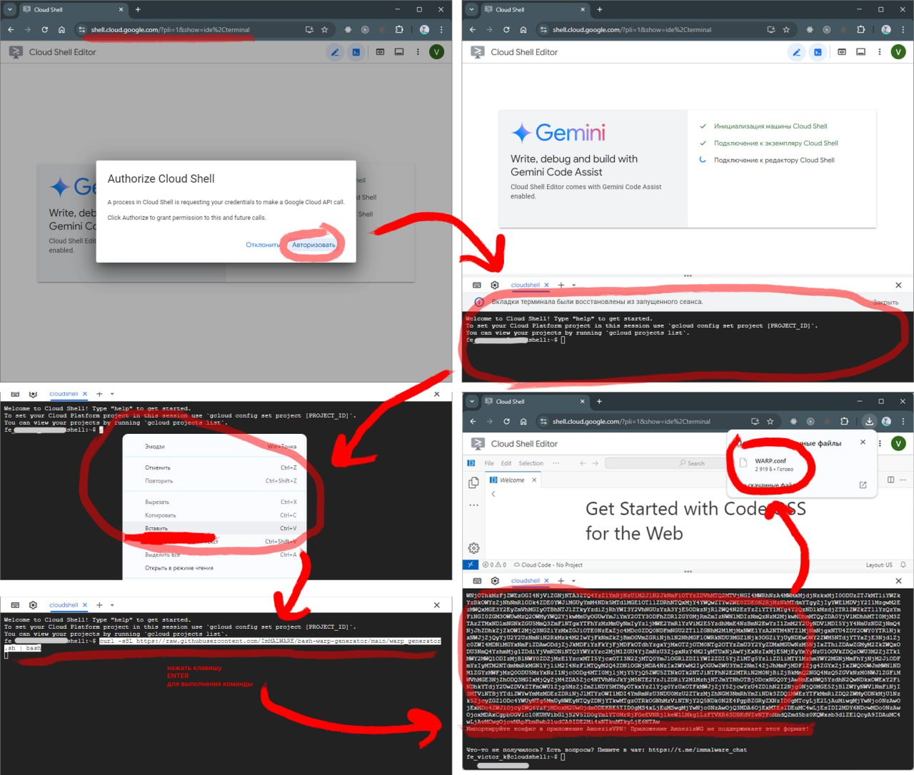
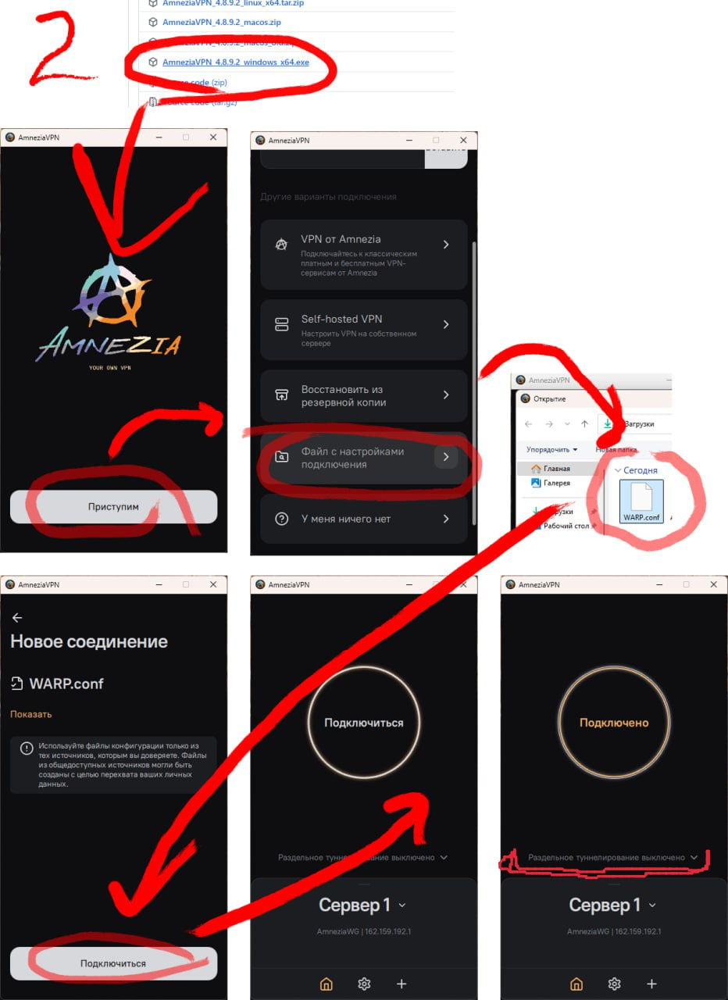

# Настройка AmneziaVPN

> Настройка AmneziaVPN для ПК и мобильного телефона.  
> Открывает доступ ко многим заблокированным ресурсам:  
> 🔴 YouTube  
> 🔵 Discord  
> 🟣 Instagram  
> 🟠 и прочему.

## 📑 Оглавление

- [1. Генерация конфига настроек](#1-генерация-конфига-настроек)
- [2. Импорт конфига настроек](#2-импорт-конфига-настроек)

## 1. Генерация конфига настроек

> [!TIP]
> <details><summary><b>Картинка - инструкция</b></summary>
> <p>
>
> 
> </p>
> </details>

1.1. Перейти в [консоль гугла по ссылке](https://shell.cloud.google.com/?pli=1&show=ide%2Cterminal) (через Google Chrome).

1.2. Скопировать и вставить команду в консоль: 
```bash
curl -sSL https://raw.githubusercontent.com/ImMALWARE/bash-warp-generator/main/warp_generator.sh | bash
```
> [!TIP]
> [описание оригинала](https://github.com/ImMALWARE/bash-warp-generator)  

1.3. Выполнить команду нажатием `Enter↵`  
1.4. Дождаться выполнения и скачать получившийся файлик `WARP.conf`. Этот файл больше не открывается в AmneziaWG 

## 2. Импорт конфига настроек

> [!TIP]
> <details><summary><b>Картинка - инструкция</b></summary>
> <p>
>
> 
> </p>
> </details>

2.1. Скачать и установить программу.
- на ПК ([AmneziaVPN...windows_x64.exe](https://github.com/amnezia-vpn/amnezia-client/releases/download/4.8.9.2/AmneziaVPN_4.8.9.2_windows_x64.exe))
если ссылка выше не работает, качаем из [общего репозитория](https://github.com/amnezia-vpn/amnezia-client/releases).
- для Android ([Google](https://github.com/amnezia-vpn/amnezia-client/releases) | [APK](https://github.com/amnezia-vpn/amnezia-client/releases/tag/4.8.9.2))
- IOS ([App Store](https://apps.apple.com/us/app/amneziavpn/id1600529900))

2.2. Импортировать скачанный файл из пункта 1.4 в прогу. `Имя файла должно быть без пробелов и скобок`   
2.3. Нажимаем `Подключиться`

2.4. В AmneziaVPN можно сделать туннелирование приложений, чтобы определенный софт/игра работали в обход Amnezia

> [!WARNING]
> Если вырубает ВЕСЬ интернет - конфиг сдох. Нужно от него отключиться и попробовать подключиться снова.  
> В случае повтора неудачи, создавай новый конфиг настроек.